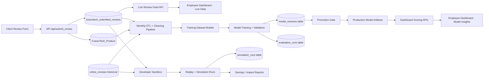

# FusionTech Review Intelligence Platform
## Strategy, Data Flow, and Coding Roadmap
### Date: March 2026

---

# 1. Project Objective

Build a reliable system with three operational personas:

- Client: submits product reviews continuously
- Employee: acts on dashboard recommendations by department
- Developer: validates model quality and runs replay simulations

Core goal: improve decision quality and reduce revenue risk from unresolved product issues.

---

# 2. Current State (As-Is)

- Review submission UI is now active and stores incoming reviews
- Product metadata is inferred from a product catalog table
- Dashboard analytics are currently artifact-driven snapshot outputs
- Model code is temporary and not yet formalized into a production model lifecycle

Implication:
- Ingestion is real-time
- Model scoring is batch/snapshot

---

# 3. Key Clarification: Real-Time vs Model Time

Real-time data stream:
- New client reviews should appear immediately in review feeds

Model time:
- Model should represent the latest approved training snapshot
- Not automatically retrained on every review

Recommended cadence:
- Monthly retraining with versioning and promotion gates

---

# 4. Client Experience (Submit Reviews)

Input fields:
- Product (autocomplete)
- Rating
- Review Title
- Review Text
- OS (optional)
- Color (optional)

System inferred fields:
- asin, main_category, title_y, store, brand, features, price
- timestamp
- user_id
- helpful_vote initialized as null

Design principle:
- Minimize friction, maximize quality of required fields

---

# 5. Employee Experience (Operational Decisioning)

Employees should:
- View all live incoming reviews
- View department-specific KPI slices and recommended actions
- Tag/escalate to other departments
- Ask AI assistant for action points

Employees should not:
- Retrain model
- Change simulation settings
- Alter evaluation baselines

---

# 6. Developer Experience (Validation and Proof)

Developer mode capabilities:

1. Holdout validation:
- Evaluate with 80/20 split

2. Replay analysis:
- Train using data up to cutoff date (example: through 2016)
- Evaluate on future windows

3. Scenario simulation:
- Simulate 3 months of client submissions
- Measure downstream employee recommendations and risk trend shifts

4. Baseline comparison:
- Compare model detection lead-time vs manual trend detection

---

# 7. Data Flow (Target Architecture)

---

# 8. Coding Roadmap (Recommended)

Phase 1: Stabilize ingestion
- Finalize submit-review contract and validation
- Ensure product autocomplete and metadata inference are robust
- Add clear error handling and submission audit fields

Phase 2: Model lifecycle foundation
- Add model registry tables:
  - model_versions
  - evaluation_runs
  - simulation_runs
- Add explicit deployed_model pointer

Phase 3: ETL and training pipeline hardening
- Build repeatable monthly pipeline
- Include data quality checks, dedup, and schema validation
- Version datasets used for each training run

Phase 4: Employee UX separation
- Split UI into:
  - Live reviews panel
  - Model-driven recommendations panel
- Show model version and trained-through date on dashboard

Phase 5: Developer mode
- Add replay controls and simulation controls
- Generate validation and revenue-impact reports
- Preserve sandbox isolation from production

---

# 9. Data Governance Rules

- Never overwrite raw submitted reviews
- Use append-only strategy for review events
- Track training dataset version hash per model run
- Promotion to production requires metric thresholds
- Every model decision should be traceable to version + dataset window

---

# 10. Suggested Database Additions

model_versions:
- model_version_id
- trained_through_date
- training_start_date
- training_end_date
- train_size
- test_size
- metrics_json
- artifact_path
- is_deployed
- created_at

evaluation_runs:
- evaluation_id
- model_version_id
- run_type (holdout/replay/simulation)
- period_start
- period_end
- precision
- recall
- lead_time_days
- revenue_impact_json
- created_at

simulation_runs:
- simulation_id
- model_version_id
- scenario_name
- start_date
- end_date
- injected_review_count
- output_summary_json
- created_at

---

# 11. Success Metrics

Client layer:
- submission completion rate
- validation error rate

Employee layer:
- action adoption rate
- escalation response time
- issue resolution cycle time

Developer layer:
- precision/recall for risk alerts
- average lead time vs manual detection
- estimated monthly revenue risk reduced

---

# 12. Immediate Next Sprint (Actionable)

1. Implement model registry tables and migration scripts
2. Add deployed model metadata API endpoint
3. Add dashboard banner:
- Live reviews updated at
- Model version and trained-through date
4. Implement monthly retrain command pipeline
5. Add replay runner for one historical window and produce first comparison report

---

# 13. Final Recommendation

Treat the platform as two clocks running in parallel:

- Clock A: real-time review ingestion for operational awareness
- Clock B: controlled model refresh cadence for reliable recommendations

This separation gives:
- operational trust for employees
- methodological rigor for developers
- continuous voice-of-customer capture from clients
